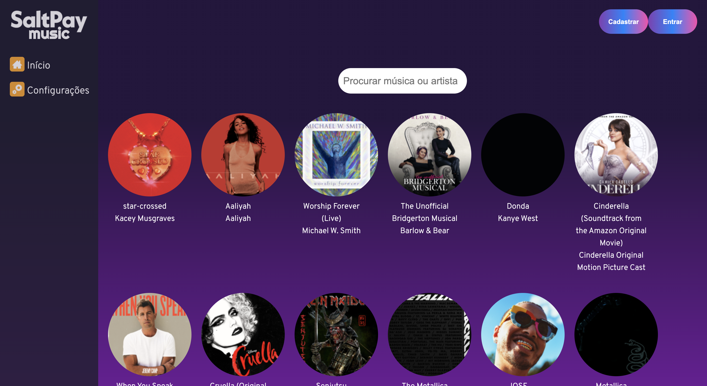
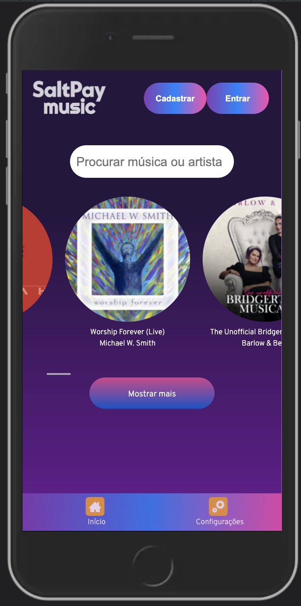

# SaltPay Music

SaltPay Music is a music library based on a public api provided by Itunes. Built with React JS, this app has features which can provide an excellent user experience. The app can be used in 2 different languages (English and Portuguese) and is responsible for mobiles.

# Features:
- Login Area:

  - A previous registered user can login into the app.

  - Validates email and password.

- Sign Area

  - Saves user information in LocalStorage.

  - Validates user information.

- Main Screen

  - Show a list of the top albums in iTunes. 

  - Button to show more albums.

  - A search bar to search by album or artist.

  - When clicking on a album a modal appears with more information.

  - The album can be added as favourite and also can be added to a playlist (if exists)

  - The price show depends on the currency selected.

- Sidebar

  - To navigate on the app.

  - Some options only appears upon login with an account with Pro subscription.

- Settings

  - User can change language of the app.

  - User can select a currency which will show the album price for the selected currency.

  - When logged in user can sign out

- Favourites

  - Show a list of albums which were selected as favourites.

  - When clicking the album the favourite goes away.

- Playlist

  - The user can create a playlist and and albums to items, as well as remove them.

  - The playlist can be named.

  - To create a playlist minimum of 4 albums must be added.

  - After a playlist is created it can be deleted and also a song can be added to it in the details modal.

### Packages

In this app thw following packages were used:

- Redux:

  - For state management

- React-router-dom:

  - To create routes for navigation 

- Axios:

  - as http client to make api calls

- Redux Thunk:

  - to make asynchronous calls with redux

- Moment:

  - To work with dates more easily

- Uuid:

  - To create uuids for the users

- i18n:

  - As a translator helper:

- node-sas:

  - To interpret scss files instead of css

- React Testing Library:

  - For unit tests

- EsLint:

  - linter tool

### Styling

To style the application the main tool used was Sass. There were 3 main ways of working with it:
- Modules: Each component has its own module so if a component has a class name same as another component it won't affect it when change occurs.
- Styleguide: A set of variables for colors and properties to make easier to attribute the styles
- uikit: some components that can be reused as the styles are the same across the entire application

The icon fonts were provided by icomoon.

### Services
Two apis were used:
- https://itunes.apple.com/us/rss/topalbums/limit=100/json':

  -- retrieves a list of albums from itunes

- https://v6.exchangerate-api.com/v6/1953d60501dca42f49061336/latest/USD:

  -- retrieves the latest currency rates for a variety of currencies

This apis were managed through a service architecture where a single request is made when loading the app thanks to redux-thunk which can make asynchronous requests and store the data and also exceptions can be controled.

### Storage

No database is provided, hence the localstorage was used to mock a database. It stores the user info and login status and language choice so it can be loaded upon refreshing the app.

### Installation and Run
clone the repository, install dependencies and start the app

``$ npm install``

``$ npm start``

